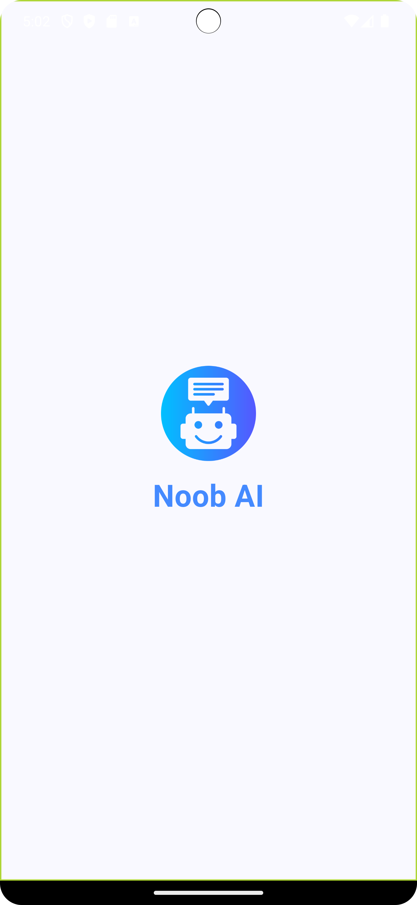
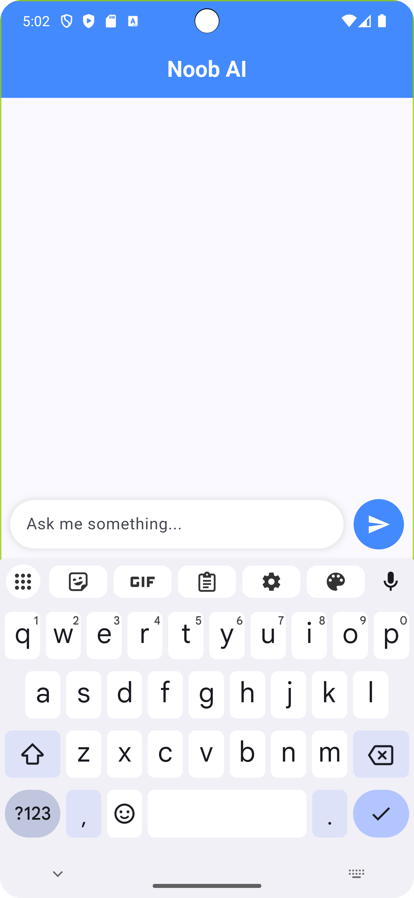
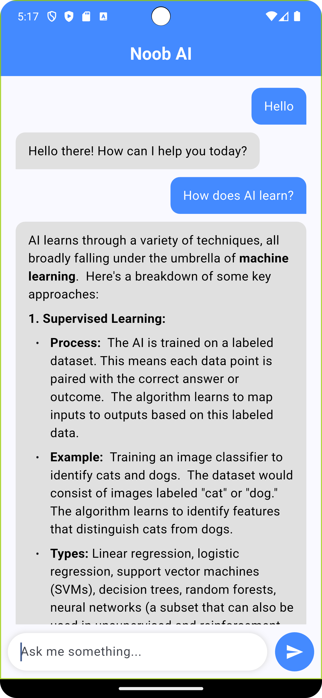

# 🤖 Noob AI

**Noob AI** is a sleek and intuitive chatbot app built with Flutter, powered by **Google Gemini API**. It supports real-time AI-driven conversations and beautifully renders Markdown-formatted responses like **bold**, _italic_, and `code`.

---

## ✨ Features

- 💬 Chat interface with clean, modern design  
- ⚡ Real-time conversation powered by Google Gemini  
- 📝 Markdown support (e.g., **bold**, _italic_, `code`)  
- 🎯 Smooth state management using `StatefulWidget`  
- 📱 Fully responsive and mobile-ready UI  

---

## 📸 Screenshots

  
  
  

---

## 🛠 Built With
- Flutter
- Dart
- Google Gemini API
- flutter_markdown
- http

---

Developed with ❤️ by Abhimanyu
